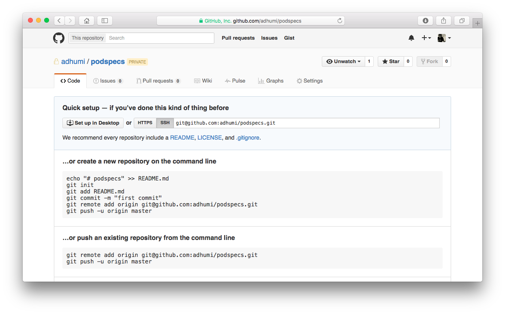
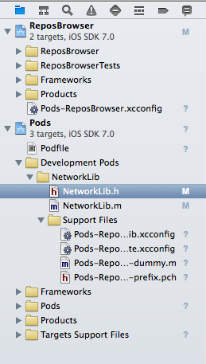

footer: Cocoaheads Paris, 11/02/2016


# **__☙__**  *COCOAPODS*  **__❧__**
# **_for private libraries_**

##### Adrien Humilière - Captain Train

---

# *☙  Cocoapods?  ❧*    

^ C'est quoi?

---

## Dependency manager

^ Gestionnaire de dépendances

---

## **__+__** 3000 pods

^ pods aka librairies

---

```
platform :ios, '8.0'

target 'App' do
  pod 'Alamofire', '~> 3.1.0'
end
```

^ Aussi simple qu'un fichier comme ça

---

```
$ pod install
$ open App.xcworkspace
```

^ et une commande comme ça dans le terminal

---

# *☙  Private pods  ❧*    

^ blabla sur les libs internes/privées des boites ou perso

---

## **_1_**  Create a Pods repository

^ Un va avoir besoin d'un repo qui serve

---



^ Un simple repo suffit…
Pas besoin d'en faire un clone en local.
Un repo local sur votre machine peut suffire mais intérêt limité.
La seule contrainte est que le repo soit accessible à tous ceux qui utiliseront les pods qui y figurent.

---

```
$ pod repo add adhumi git@github.com:adhumi/podspecs.git
```

^ J'ajoute mon repo comme j'ajouterai une remote sur Git

---

## *✓*

^ On est bons

---

## **_2_**  Make a Pod

---

```
$ cd MyPrivateLibrary
$ pod create spec MyPrivateLibrary
```

^ Je créée mon Pod (enfin, ses specs) dans le dossier qui va bien avec la commande qui va bien

---

```
Pod::Spec.new do |s|
  s.name         = "MyPrivateLibrary"
  s.version      = "1.0.0"
  s.summary      = "Lorem ipsum dolor sit amet."
  
  [...]
end
```

^ Je remplis mon fichier avec les informations qui vont bien
Jusqu'ici c'est le processus standard pour créer un pod, rien de spécifique.

---

```
$ pod repo push adhumi MyPrivateLibrary.podspec
```

---

## *✓*

---

## **_3_**  Use my private pod

---

```
platform :ios, '8.0'

target 'App' do
  pod 'Alamofire', '~> 3.1.0'
  pod 'MyPrivateLibrary'
end
```

^ Je reprend mon Podfile de tout à l'heure et j'ajoute MyPrivateLibrary

---

```
$ pod install
Updating local specs repositories
 
Analyzing dependencies
[!] Unable to find a specification for `TSPTableView`
```

^ Et là patatra, c'est l'erreur

---

```
source 'git@github.com:adhumi/podspecs.git'
source 'https://github.com/CocoaPods/Specs.git'

platform :ios, '8.0'

target 'App' do
  pod 'Alamofire', '~> 3.1.0'
  pod 'MyPrivateLibrary'
end
```

^ Tout ce que j'ai à faire c'est reprendre mon podfile et ajouter l'URL de mon repo de specs

---

```
$ pod install
Updating local specs repositories
 
Analyzing dependencies
Downloading dependencies
Installing Alamofire (3.1.7)
Installing MyPrivateLibrary (0.0.1)
Generating Pods project
Integrating client project
 
[!] Please close any current Xcode sessions and use 
`App.xcworkspace` for this project from now on.
```

---

## *✓*

^ On est bons

---

## **_4_**  Develop a private library

^ Comment on fait pour bosser sur ces librairies
Est ce qu'on est obligé de bosser les yeux fermés

---

```
target 'App' do
  pod 'Alamofire', '~> 3.1.0'
  pod 'MyPrivateLibrary', :path => '~/MyPrivateLibrary'
end
```

^ Je specifie le chemin vers le clone de mon repo en local

---

```
$ pod update
```

---



^ un dossier *Development pods* apparait dans Xcode. On peut directement travailler les fichiers, il ne s'agit que d'une référence vers leur *vrai* emplacement dans le filesystem.

---

# *…*

^ on peut faire son travail de developpement.

---

```
$ vim MyPrivateLibrary.podspec
$ git commit
$ git tag 1.0.1
$ git push
$ pod repo push adhumi MyPrivateLibrary.podspec
```

^ quand on a fini ou qu'on veut pousser une version du pod, on y va et on refait cette manip

---

```
target 'App' do
  pod 'Alamofire', '~> 3.1.0'
  pod 'MyPrivateLibrary'
end
```

```
$ pod update
```

^ Je remodifie mon podfile, pod update et c'est reparti 

---

## *✓*

^ On est bons

---

# *☙  Why?  ❧*

---

## Internal Libs

^ Cas standard

---

## Forked external Libs

^ Plus simple que de simplement specifier le repo dans le podfile

---

## External Libs with
## no Cocoapods support

^ De moins en moins, mais certaines libs n'ont pas podspecs. Permet de les utiliser quand meme via Cocoapods

---

# *☙  Tips  ❧*

---

# HTTP **__vs.__** SSH

^ Cocoapods ne supporte pas SSH par défaut. Il faut bypasser la verification pour que ça marche.

---

## --allow-warnings
## --use-libraries

^ --allow-warnings permet de bypasser une partie du linter avant l'upload du pod. En gros pour passer même si il y a des warnings. Donc utilse, notamment pour SSH.

^ --use-libraries permet d'integrer des binaires dans ses pods

^ Peut vous sauver la vie

---

# *Thanks* *__:-)__*

---

# *Questions* *__?__*
#### captaintrain.com/jobs

---
 
## *__@__adhumi*
##### adhumi@captaintrain.com